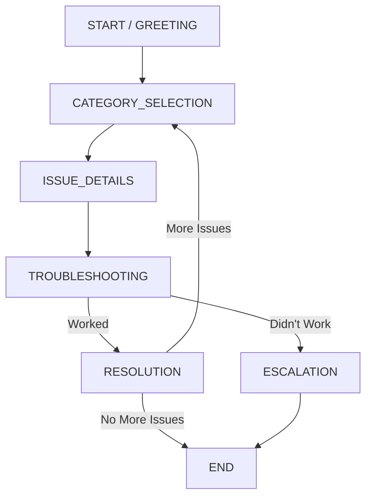

# 🤖 SmartDesk Bot (AI-Powered IT Support Chatbot)




SmartDesk Bot is a **Python-based, state-driven IT support chatbot** designed to assist users with common IT issues such as Wi‑Fi connectivity, printers, password resets, and email login errors.

This project demonstrates **state-machine design, clean architecture, and incremental AI integration**

---

## ✨ Key Features (V1)

* Guided, conversational troubleshooting
* Deterministic **state-machine architecture**
* Clear separation of concerns (states, routing, utilities)
* Safe handling of invalid input and unfinsihed states

---

## 🏗️ Architecture Overview

SmartDesk Bot uses a **finite state machine (FSM)** pattern.


### High-Level Flow

```
User Input
   ↓
main.py (Main Loop)
   ↓
Flow Controller
   ↓
State Handler (START, CATEGORY_SELECTION, etc.)
   ↓
Next State Returned
   ↓
Main Loop Continues
```

### Core Principles

* Each state:

  * Displays output
  * Accepts **one type of input**
  * Returns **exactly one next state**
* The main loop never contains business logic
* The flow controller is the single source of truth for routing

* Detailed architecture and design notes are available in docs/architecture.md

---

## 📁 Project Structure

```
ai-chatbot/
│
├── main.py                  # Application entry point & main loop
│
├── bot/                     # All chatbot logic
│   ├── __init__.py
│   ├── flow_controller.py   # Central state router
│   ├── utils.py             # Shared helpers (validation, formatting)
│   └── states/              # Individual conversation states
│       ├── __init__.py
│       ├── start_state.py       # State 1: Greeting
│       ├── category_state.py    # State 2: Category selection
│       ├── issue_state.py       # State 3: Issue details
│       ├── troubleshoot.py      # State 4: Troubleshooting
│       └── end_state.py         # State 6: Exit & feedback
│
└── README.md
```

---

## 🔁 State Machine Design (V1)

### State 1: START / GREETING

**Purpose**

* Welcome the user
* Explain what SmartDesk Bot can help with

**Transitions**

* ➡️ `CATEGORY_SELECTION`

---

### State 2: CATEGORY_SELECTION

**Purpose**

* Let the user select a problem category

**Transitions**

* Valid selection ➡️ `ISSUE_DETAILS`
* Invalid / unclear input ➡️ `CATEGORY_SELECTION`

---

### State 3: ISSUE_DETAILS

**Purpose**

* Collect free-text details about the selected issue

**Transitions**

* ➡️ `TROUBLESHOOTING`

---

### State 4: TROUBLESHOOTING

**Purpose**

* Provide structured, step-by-step troubleshooting
* Confirm whether each step resolves the issue

**Transitions**

* Resolved ➡️ `RESOLUTION`
* Not resolved ➡️ `ESCALATION`

---

### State 5: RESOLUTION / ESCALATION

**Purpose**

* Close the issue gracefully
* Escalate to human support if required

**Transitions**

* More help ➡️ `CATEGORY_SELECTION`
* Exit ➡️ `END`

---

### State 6: END

**Purpose**

* End the conversation cleanly
* Optionally collect feedback (1-5 rating)

---

* Full debugging notes, lessons learned, and AI/NLU plans are in docs/debugging.md and docs/ai_plan.md.

---

## 🚀 Project Goals

* Build a production-quality conversational system
* Demonstrate mastery of state-machine design
* Apply clean architecture principles in Python
* Create a portfolio-ready AI-focused project

---

## 🧑‍💻 Author

**Lutendo Matshidze**
Computer Science Graduate | Aspiring AI & Software Engineer

---

## 📌 Project Status

🚧 **In Progress** — Incremental development by chatbot state
